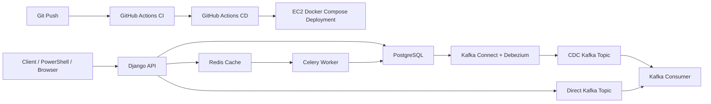

# RetailFlow Lab

RetailFlow Lab is an infra-first backend systems project built to practice how real backend applications move from local development to containerized runtime, CI, CD, and cloud deployment.

The business theme is retail inventory and order processing, but the primary learning goal is infrastructure:

- PostgreSQL as the transactional database
- Redis for cache and Celery transport
- Celery for async work
- Kafka for streaming
- Debezium for CDC
- Docker Compose for local and EC2 runtime
- GitHub Actions for CI/CD
- EC2 as the first cloud deployment target

## Current Checkpoint

The project has now reached a meaningful V1 infrastructure milestone.

Current working capabilities:

- Django API running locally and on EC2
- PostgreSQL-backed order and inventory data model
- Redis-backed cache probe endpoint
- Celery worker processing async order work
- Direct Kafka publishing from Django
- Sample SQS and SNS publishing from Django
- Sample Lambda handler for `SQS -> Lambda -> SNS` learning flow
- Debezium CDC from PostgreSQL into Kafka
- Kafka consumer that classifies direct events vs CDC events
- Full local Docker Compose stack for infra + app services
- Reduced EC2 Docker Compose stack for `api + celery-worker + postgres + redis`
- GitHub Actions CI for lint, Django checks, migration checks, tests, and Docker image builds
- GitHub Actions CD for deployment to EC2 over SSH

In plain terms: we now have a backend application that can be developed locally, validated in CI, and deployed to a real VM through CD.

## What Is Running Where

### Local Full Stack

Local development can run:

- `api`
- `celery-worker`
- `kafka-consumer`
- `postgres`
- `redis`
- `zookeeper`
- `kafka`
- `kafka-connect`

Main file:

- [infra/docker-compose/docker-compose.local.yml](C:\Users\vipul\OneDrive\Desktop\SelfDev\DevHandsOn\infra\docker-compose\docker-compose.local.yml)

### EC2 Reduced Stack

The EC2 deployment intentionally keeps the stack lighter:

- `api`
- `celery-worker`
- `postgres`
- `redis`

Main file:

- [infra/docker-compose/docker-compose.ec2.yml](C:\Users\vipul\OneDrive\Desktop\SelfDev\DevHandsOn\infra\docker-compose\docker-compose.ec2.yml)

Kafka and Debezium stay local for now so the EC2 instance remains Free Tier-friendly and easier to reason about.

## Documentation Map

Read these in this order:

1. [README.md](C:\Users\vipul\OneDrive\Desktop\SelfDev\DevHandsOn\README.md)
2. [running.md](C:\Users\vipul\OneDrive\Desktop\SelfDev\DevHandsOn\running.md)
3. [docs/project-explainer.md](C:\Users\vipul\OneDrive\Desktop\SelfDev\DevHandsOn\docs\project-explainer.md)
4. [docs/ec2-deployment-roadmap.md](C:\Users\vipul\OneDrive\Desktop\SelfDev\DevHandsOn\docs\ec2-deployment-roadmap.md)
5. [docs/infra-first-roadmap.md](C:\Users\vipul\OneDrive\Desktop\SelfDev\DevHandsOn\docs\infra-first-roadmap.md)

Use them like this:

- `README.md`: high-level status and repo map
- `running.md`: operational runbook
- `project-explainer.md`: top-down infra understanding
- `ec2-deployment-roadmap.md`: EC2 and CD deployment path
- `infra-first-roadmap.md`: what we should build next and in what order

## Architecture

## Important Files

Core application:

- [backend/retailflow/settings.py](C:\Users\vipul\OneDrive\Desktop\SelfDev\DevHandsOn\backend\retailflow\settings.py)
- [backend/apps/orders/serializers.py](C:\Users\vipul\OneDrive\Desktop\SelfDev\DevHandsOn\backend\apps\orders\serializers.py)
- [backend/apps/orders/tasks.py](C:\Users\vipul\OneDrive\Desktop\SelfDev\DevHandsOn\backend\apps\orders\tasks.py)
- [backend/apps/events/kafka.py](C:\Users\vipul\OneDrive\Desktop\SelfDev\DevHandsOn\backend\apps\events\kafka.py)
- [workers/kafka_consumer/main.py](C:\Users\vipul\OneDrive\Desktop\SelfDev\DevHandsOn\workers\kafka_consumer\main.py)

Infrastructure:

- [infra/docker-compose/docker-compose.local.yml](C:\Users\vipul\OneDrive\Desktop\SelfDev\DevHandsOn\infra\docker-compose\docker-compose.local.yml)
- [infra/docker-compose/docker-compose.ec2.yml](C:\Users\vipul\OneDrive\Desktop\SelfDev\DevHandsOn\infra\docker-compose\docker-compose.ec2.yml)
- [infra/docker-compose/debezium-postgres.json](C:\Users\vipul\OneDrive\Desktop\SelfDev\DevHandsOn\infra\docker-compose\debezium-postgres.json)
- [infra/ec2/.env.ec2.example](C:\Users\vipul\OneDrive\Desktop\SelfDev\DevHandsOn\infra\ec2\.env.ec2.example)

Automation:

- [.github/workflows/ci.yml](C:\Users\vipul\OneDrive\Desktop\SelfDev\DevHandsOn\.github\workflows\ci.yml)
- [.github/workflows/deploy-dev.yml](C:\Users\vipul\OneDrive\Desktop\SelfDev\DevHandsOn\.github\workflows\deploy-dev.yml)
- [scripts/aws/ec2-bootstrap.sh](C:\Users\vipul\OneDrive\Desktop\SelfDev\DevHandsOn\scripts\aws\ec2-bootstrap.sh)
- [scripts/aws/deploy-ec2.sh](C:\Users\vipul\OneDrive\Desktop\SelfDev\DevHandsOn\scripts\aws\deploy-ec2.sh)

## V1 Outcome

The current V1 outcome is:

- local event-driven infra works
- Dockerized app runtime works
- manual EC2 deployment works
- GitHub Actions CI works
- GitHub Actions CD works

That means the project already covers a realistic first backend-infra journey:

1. build the app
2. containerize it
3. add async/background execution
4. add event streaming
5. add CI
6. deploy to a cloud VM through CD

## Security Note

One conscious temporary compromise exists in the current setup:

- port `22` and port `8000` may be open to `0.0.0.0/0` to allow GitHub-hosted runners and public testing

That is acceptable for a learning-stage dev environment, but not where we should stop.

This is one of the next cleanup steps:

- reduce public exposure
- tighten security groups
- eventually keep the database outside the VM

## Free Tier Position

The current deployment path is aligned with AWS Free Tier thinking:

- EC2 first, not EKS
- Docker Compose first, not Kubernetes on AWS
- local Kafka instead of MSK
- local Debezium instead of managed streaming stack
- PostgreSQL in Docker now, RDS later as the next major infra step

## Recommended Next Steps

Best next order from here:

1. move PostgreSQL from EC2 container to RDS
2. tighten security groups and deployment exposure
3. improve CD with branch/environment discipline
4. add small AWS service integrations like SQS, SNS, S3, or Lambda
5. later decide whether Terraform should manage those cloud resources

## Quick Repo Description

Suggested GitHub repo description:

`Infra-first backend systems lab using Django, PostgreSQL, Redis, Celery, Kafka, Debezium, Docker, GitHub Actions CI/CD, and AWS EC2.`
