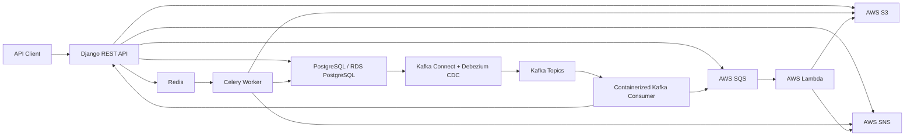

# RetailFlow Lab

RetailFlow Lab is a from-scratch, hands-on backend project for practicing distributed systems with Python, Django, PostgreSQL, Kafka, Debezium CDC, Redis, Celery, Docker, Kubernetes, Terraform, and selected AWS services.

The project theme is a retail inventory and replenishment platform. It is intentionally aligned with real backend work: inventory updates, order placement, warehouse allocation, async processing, CDC event streams, notifications, object storage, CI/CD, and cloud deployment.

This README is the living project guide. We will keep updating it as each phase is implemented.

## Target Outcome

Build a production-style backend system that can:

- Manage stores, warehouses, SKUs, inventory snapshots, purchase orders, and replenishment recommendations.
- Expose Django REST APIs for inventory and order workflows.
- Persist transactional data in PostgreSQL.
- Emit database changes through Debezium CDC into Kafka.
- Run Kafka consumers as containerized services.
- Run Celery workers backed by Redis.
- Publish selected events to AWS SQS and SNS.
- Store generated reports or import files in S3.
- Use Lambda for lightweight event processing.
- Provision cloud infrastructure with Terraform.
- Package services with Docker.
- Deploy local Kubernetes workloads with resource requests and limits.
- Use CI/CD YAML pipelines for tests, builds, linting, Docker image creation, and deployment gates.

## Cost Guardrails

The project should stay compatible with AWS Free Tier wherever possible.

Important note: Amazon RDS has Free Tier options for small database instances, but Aurora is usually not a safe default for a zero-cost learning project. We will handle this in two tracks:

- Default track: local PostgreSQL plus optional AWS RDS PostgreSQL Free Tier instance.
- Optional Aurora track: Terraform module and documentation only, created manually when you explicitly approve it, then destroyed immediately after testing.

AWS services we can use cautiously:

- S3: use tiny files and lifecycle cleanup.
- Lambda: small functions with low invocation counts.
- SQS and SNS: low-volume event testing.
- RDS PostgreSQL: only if your account has eligible Free Tier remaining.
- EC2 SSH bastion: optional, only if eligible Free Tier is confirmed.

Services to avoid by default because they can become costly:

- MSK / managed Kafka.
- Long-running Aurora clusters.
- EKS clusters.
- NAT gateways.
- Large EC2 instances.

For Kubernetes, we will start with local Kubernetes using Docker Desktop, kind, or minikube. This gives hands-on manifests, resource allocation, services, config maps, secrets, deployments, jobs, and horizontal-scaling concepts without EKS cost.

## Architecture



## Proposed Repository Structure

```text
retailflow-lab/
  README.md
  backend/
    manage.py
    retailflow/
    apps/
      inventory/
      orders/
      replenishment/
      events/
    requirements/
      base.txt
      dev.txt
      prod.txt
    Dockerfile
  workers/
    celery_worker/
    kafka_consumer/
  infra/
    docker-compose/
      docker-compose.local.yml
      debezium-postgres.json
    terraform/
      modules/
        s3/
        sqs/
        sns/
        lambda/
        rds-postgres/
        aurora-optional/
      envs/
        dev/
    kubernetes/
      namespace.yml
      postgres.yml
      redis.yml
      django-api.yml
      celery-worker.yml
      kafka-consumer.yml
  lambda/
    event_archiver/
  scripts/
    aws/
    db/
    kafka/
    local/
  .github/
    workflows/
      ci.yml
      deploy-dev.yml
```

## Roadmap

### Phase 0: Project Charter and Local Tooling

Goal: establish the workspace, install local tools, and document commands.

Planned work:

- Confirm local versions of Python, Docker, Git, AWS CLI, Terraform, kubectl, and a local Kubernetes runtime.
- Create the base repository structure.
- Add `.gitignore`, environment templates, and command scripts.
- Create this README as the source of truth.

Hands-on commands will include:

```powershell
python --version
docker --version
aws --version
terraform --version
kubectl version --client
git status
```

### Phase 1: Django API + PostgreSQL

Goal: build the core backend service.

Planned work:

- Create a Django project with Django REST Framework.
- Add apps for inventory, orders, replenishment, and events.
- Model stores, warehouses, SKUs, inventory balances, orders, and event logs.
- Add API endpoints for inventory updates and order creation.
- Add PostgreSQL through Docker Compose.
- Add migrations and seed data.

Hands-on commands will include:

```powershell
docker compose -f infra/docker-compose/docker-compose.local.yml up -d postgres
python backend/manage.py migrate
python backend/manage.py createsuperuser
python backend/manage.py runserver
```

### Phase 2: Redis + Celery

Goal: move slow workflows out of the request path.

Planned work:

- Add Redis through Docker Compose.
- Add Celery to Django.
- Create async tasks for replenishment scoring, report generation, and notification dispatch.
- Add retry policies and idempotency keys.
- Add a scheduled Celery beat job for daily replenishment recommendations.

Hands-on commands will include:

```powershell
docker compose -f infra/docker-compose/docker-compose.local.yml up -d redis
celery -A retailflow worker -l info
celery -A retailflow beat -l info
```

### Phase 3: Kafka + Kafka Connect + Debezium CDC

Goal: stream PostgreSQL changes into Kafka topics.

Planned work:

- Add Kafka and Kafka Connect locally through Docker Compose.
- Configure PostgreSQL logical replication.
- Add Debezium PostgreSQL connector.
- Stream inventory and order table changes into Kafka topics.
- Build a Python Kafka consumer service.
- Store consumed event offsets and add retry-safe processing.

Hands-on commands will include:

```powershell
docker compose -f infra/docker-compose/docker-compose.local.yml up -d kafka kafka-connect
docker exec -it retailflow-kafka bash
docker exec -it retailflow-postgres psql -U retailflow -d retailflow
curl -X POST http://localhost:8083/connectors -H "Content-Type: application/json" --data @infra/docker-compose/debezium-postgres.json
```

### Phase 4: AWS S3, SQS, SNS, and Lambda

Goal: integrate low-cost AWS services through code and Terraform.

Planned work:

- Create Terraform modules for S3, SQS, SNS, and Lambda.
- Add least-privilege IAM policies.
- Add Django code to upload generated reports to S3.
- Add event publishing to SQS and SNS.
- Add a Lambda function that consumes SQS messages and archives event payloads to S3.
- Keep payloads tiny and clean up test resources.

Hands-on commands will include:

```powershell
aws configure
aws sts get-caller-identity
terraform -chdir=infra/terraform/envs/dev init
terraform -chdir=infra/terraform/envs/dev plan
terraform -chdir=infra/terraform/envs/dev apply
aws s3 ls
aws sqs list-queues
aws sns list-topics
aws lambda list-functions
```

### Phase 5: RDS PostgreSQL and Optional Aurora

Goal: practice database provisioning and remote connectivity.

Planned work:

- Add Terraform for an RDS PostgreSQL Free Tier style instance.
- Keep the default instance small and single-AZ.
- Document security groups, subnet groups, credentials, and teardown.
- Connect from local terminal using `psql`.
- Optionally add Aurora Terraform config, but do not apply it unless explicitly approved.

Hands-on commands will include:

```powershell
terraform -chdir=infra/terraform/envs/dev plan -target=module.rds_postgres
psql "host=<rds-endpoint> port=5432 dbname=retailflow user=<user> sslmode=require"
terraform -chdir=infra/terraform/envs/dev destroy -target=module.rds_postgres
```

### Phase 6: Dockerization

Goal: package all runnable services.

Planned work:

- Add Dockerfiles for Django API, Celery worker, and Kafka consumer.
- Add Docker Compose profiles for local development.
- Add health checks.
- Add environment-specific settings.

Hands-on commands will include:

```powershell
docker build -t retailflow-api:local backend
docker build -t retailflow-kafka-consumer:local workers/kafka_consumer
docker compose -f infra/docker-compose/docker-compose.local.yml up --build
```

### Phase 7: Kubernetes

Goal: deploy the app locally with production-style resource allocation.

Planned work:

- Add Kubernetes manifests for API, Celery worker, Kafka consumer, Redis, and local Postgres.
- Add config maps and secrets.
- Add readiness and liveness probes.
- Add resource requests and limits.
- Add service definitions.
- Use local Kubernetes instead of EKS to stay cost-safe.

Hands-on commands will include:

```powershell
kubectl apply -f infra/kubernetes/namespace.yml
kubectl apply -f infra/kubernetes/
kubectl get pods -n retailflow
kubectl logs -n retailflow deployment/retailflow-api
kubectl exec -it -n retailflow deployment/retailflow-api -- python manage.py migrate
```

### Phase 8: CI/CD Pipelines

Goal: practice YAML pipelines with explicit compute and deployment steps.

Planned work:

- Add GitHub Actions workflow for linting, tests, and Docker builds.
- Add service containers for PostgreSQL and Redis during tests.
- Add deployment workflow with protected manual trigger.
- Add Terraform plan workflow.
- Add resource-conscious job configuration and caching.

Hands-on files:

```text
.github/workflows/ci.yml
.github/workflows/deploy-dev.yml
.github/workflows/terraform-plan.yml
```

### Phase 9: Observability and Reliability

Goal: add production-minded operational behavior.

Planned work:

- Add structured logging.
- Add request IDs and event correlation IDs.
- Add metrics endpoint.
- Add health checks.
- Add retries, dead-letter queues, and idempotency handling.
- Add local dashboards if appropriate.

### Phase 10: Resume-Grade System Design Documentation

Goal: turn the project into something useful for interviews and portfolio discussion.

Planned work:

- Add architecture diagrams.
- Add API examples.
- Add event contracts.
- Add failure-mode notes.
- Add cost notes.
- Add a deployment runbook.
- Add an interview-style system design summary.

## Terminal-First Operating Style

We will prefer terminal-driven setup wherever possible.

Examples:

- Use `docker exec` for PostgreSQL, Redis, Kafka, and Kafka Connect.
- Use `kubectl exec` for Kubernetes debugging.
- Use `aws` CLI for S3, SQS, SNS, Lambda, IAM verification, and account checks.
- Use `terraform` for cloud resource creation.
- Use SSH only for resources that are actually SSH-capable, such as an optional EC2 bastion. Managed services like S3, SQS, SNS, Lambda, RDS, and Aurora are not SSH targets.

## First Build Milestone

The first implementation milestone should be:

1. Create Django project skeleton.
2. Add PostgreSQL, Redis, Kafka, and Kafka Connect through Docker Compose.
3. Add one inventory model and one order model.
4. Add one REST endpoint that creates an order.
5. Add one Celery task that processes the order asynchronously.
6. Add Debezium CDC for the order table.
7. Add one Kafka consumer that reacts to order events.

This gives us a complete local event-driven loop before touching AWS.

## Decisions To Confirm Before Implementation

Before Phase 1, we should confirm:

- Local Kubernetes preference: Docker Desktop Kubernetes, minikube, or kind.
- CI/CD preference: GitHub Actions, Jenkins, or both.
- AWS region.
- Whether you want Java/Spring Boot included later, or keep the main implementation Python/Django.
- Whether the optional RDS and Aurora phases should be apply-ready or documentation-only until manually approved.

