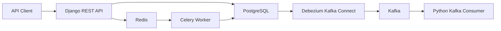

# RetailFlow Lab System Design

## Purpose

RetailFlow Lab is a learning-focused retail backend that models inventory, orders, replenishment, event streaming, async work, cloud integrations, and deployment operations.

## First Milestone Architecture

## Core Services

- Django API: owns synchronous REST workflows and transactional writes.
- PostgreSQL: system of record for stores, warehouses, SKUs, inventory, and orders.
- Redis: Celery broker and result backend for local development.
- Celery worker: processes order workflows outside the request path.
- Debezium and Kafka Connect: streams selected table changes out of PostgreSQL.
- Kafka consumer: reacts to order events and later publishes to SQS/API workflows.

## Key Design Rules

- Keep PostgreSQL as the source of truth.
- Keep REST requests fast; slower processing moves to Celery.
- Use idempotency keys for externally retried order creation.
- Stream database changes with Debezium instead of hand-publishing inside every write path.
- Start locally before using AWS to avoid accidental cost.

## Deployment Track

Local development starts with Docker Compose. Kubernetes manifests will target local clusters first. AWS integrations remain small, manually approved, and Terraform-managed.

