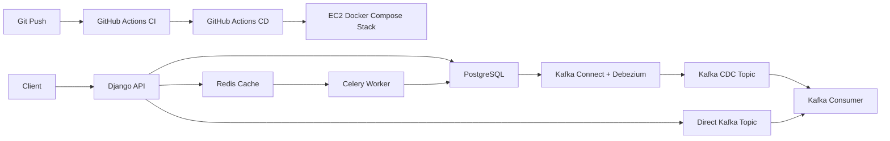

# RetailFlow Lab Project Explainer

This document explains the project from the infrastructure point of view.

The goal is not just to say what the files are. The goal is to help you understand the journey of a backend project from local setup to deployment:

1. what we built
2. why each layer exists
3. how the layers connect
4. which files control the setup
5. which commands were used
6. what is already complete
7. what should come next

## 1. Executive Summary

RetailFlow Lab is now at a strong V1 infrastructure milestone.

We already have:

- a Django backend application
- PostgreSQL as the transactional database
- Redis for cache and Celery transport
- Celery for async processing
- Kafka for streaming
- Debezium for CDC from PostgreSQL to Kafka
- Docker Compose for local runtime
- a reduced Docker Compose deployment on EC2
- GitHub Actions CI
- GitHub Actions CD
- sample AWS messaging integration points for SQS and SNS
- a sample Lambda handler for Phase 1 `SQS -> Lambda -> CloudWatch Logs`

So this is no longer just a local backend codebase. It is now a backend system that can:

- run locally with multiple infra tools
- run in containers
- be tested automatically in CI
- be deployed automatically to EC2 through GitHub Actions

That is the first major end-to-end infra milestone.

## 2. The Big Picture

At a high level, this project is made of five layers:

```text
Layer 1: Application
  Django API receives requests.

Layer 2: Transaction Storage
  PostgreSQL stores the source of truth.

Layer 3: Async and Cache
  Redis + Celery handle background work and caching.

Layer 4: Event Streaming
  Kafka carries direct application events and CDC events.

Layer 5: Delivery and Operations
  Docker Compose, GitHub Actions, and EC2 run and deploy the system.
```

That is the main mental model to keep in your head.

## 3. Two Runtime Shapes

One thing that matters a lot in infra understanding is this: the project currently has two runtime shapes.

### Local Full Stack

Local is where we learn the full infra picture.

It includes:

- Django API
- Celery worker
- Kafka consumer
- PostgreSQL
- Redis
- Zookeeper
- Kafka
- Kafka Connect
- Debezium connector

This is the "full learning environment."

### EC2 Reduced Stack

EC2 is where we learn deployment and operations without overloading the VM.

It includes:

- Django API
- Celery worker
- PostgreSQL
- Redis

It intentionally excludes:

- Kafka
- Zookeeper
- Kafka Connect
- Debezium
- Kafka consumer

Why?

- Kafka and related components are heavier
- a small EC2 instance is easier to manage without them
- we wanted a Free Tier-conscious first deployment
- this still teaches VM setup, container deployment, env management, logs, ports, CI/CD, and health checks

So local teaches the full infra integration picture. EC2 teaches the deployment picture.

## 4. End-to-End Flow

Here is the current end-to-end system flow:



Plain-English version:

1. a request hits Django
2. Django writes to PostgreSQL
3. Django may use Redis cache
4. Django may schedule async work in Celery
5. Celery consumes the task from Redis and updates data
6. PostgreSQL changes can be captured by Debezium into Kafka
7. Django can also publish directly to Kafka without CDC
8. Kafka consumer reads both kinds of Kafka events
9. GitHub Actions checks the code in CI
10. GitHub Actions can deploy the code to EC2 in CD

## 5. Infrastructure Components and Why They Exist

### PostgreSQL

PostgreSQL is the source of truth.

Why we use it:

- stores business data
- supports relational consistency
- supports transactions
- supports logical replication, which Debezium uses for CDC

Current usage:

- stores inventory, warehouses, stores, SKUs, orders, order lines
- local stack exposes it on host port `5433` to avoid conflict with an existing local Postgres
- EC2 stack keeps it internal to Docker

Main files:

- [backend/retailflow/settings.py](C:\Users\vipul\OneDrive\Desktop\SelfDev\DevHandsOn\backend\retailflow\settings.py)
- [infra/docker-compose/docker-compose.local.yml](C:\Users\vipul\OneDrive\Desktop\SelfDev\DevHandsOn\infra\docker-compose\docker-compose.local.yml)
- [infra/docker-compose/docker-compose.ec2.yml](C:\Users\vipul\OneDrive\Desktop\SelfDev\DevHandsOn\infra\docker-compose\docker-compose.ec2.yml)

### Redis

Redis plays two roles right now:

1. Celery broker/result backend
2. Django cache backend

Why we use it:

- very fast in-memory store
- simple for queue transport in learning projects
- easy way to demonstrate cache behavior

Current split:

- DB `0`: Celery broker
- DB `1`: Celery results
- DB `2`: Django cache

Main files:

- [backend/retailflow/settings.py](C:\Users\vipul\OneDrive\Desktop\SelfDev\DevHandsOn\backend\retailflow\settings.py)
- [infra/docker-compose/docker-compose.local.yml](C:\Users\vipul\OneDrive\Desktop\SelfDev\DevHandsOn\infra\docker-compose\docker-compose.local.yml)
- [infra/docker-compose/docker-compose.ec2.yml](C:\Users\vipul\OneDrive\Desktop\SelfDev\DevHandsOn\infra\docker-compose\docker-compose.ec2.yml)

### Celery

Celery handles work that should not happen directly inside the API request.

Why we use it:

- separates request-response work from background processing
- models real backend systems better than doing everything synchronously
- lets us learn retry and worker concepts

Current task behavior is intentionally simple:

- order is created in Django
- a Celery task is scheduled after commit
- Celery marks the order as `processing`

This is simple business logic, but enough to make async infrastructure real.

Main files:

- [backend/retailflow/celery.py](C:\Users\vipul\OneDrive\Desktop\SelfDev\DevHandsOn\backend\retailflow\celery.py)
- [backend/apps/orders/tasks.py](C:\Users\vipul\OneDrive\Desktop\SelfDev\DevHandsOn\backend\apps\orders\tasks.py)
- [backend/apps/orders/serializers.py](C:\Users\vipul\OneDrive\Desktop\SelfDev\DevHandsOn\backend\apps\orders\serializers.py)

### Kafka

Kafka is the event transport layer.

Why we use it:

- to learn event streaming concepts
- to observe direct app events separately from CDC events
- to understand partitioning, keys, topics, and consumers

Two main Kafka paths exist in this project:

1. direct publish path
2. CDC path through Debezium

Direct path:

- Django publishes an event directly to Kafka

CDC path:

- PostgreSQL change happens
- Debezium captures it
- Kafka receives the CDC event

Main files:

- [backend/apps/events/kafka.py](C:\Users\vipul\OneDrive\Desktop\SelfDev\DevHandsOn\backend\apps\events\kafka.py)
- [infra/docker-compose/docker-compose.local.yml](C:\Users\vipul\OneDrive\Desktop\SelfDev\DevHandsOn\infra\docker-compose\docker-compose.local.yml)
- [workers/kafka_consumer/main.py](C:\Users\vipul\OneDrive\Desktop\SelfDev\DevHandsOn\workers\kafka_consumer\main.py)

### Debezium and Kafka Connect

Debezium is how we demonstrate CDC.

Why we use it:

- teaches how database changes become stream events
- shows the difference between application-published events and database-derived events
- is very common in event-driven data platforms

Kafka Connect hosts the Debezium connector.

Important idea:

- Debezium does not replace application logic
- it observes committed database changes and publishes them to Kafka

Main files:

- [infra/docker-compose/debezium-postgres.json](C:\Users\vipul\OneDrive\Desktop\SelfDev\DevHandsOn\infra\docker-compose\debezium-postgres.json)
- [infra/docker-compose/docker-compose.local.yml](C:\Users\vipul\OneDrive\Desktop\SelfDev\DevHandsOn\infra\docker-compose\docker-compose.local.yml)

### Docker Compose

Docker Compose is the runtime orchestrator for this project today.

Why we use it:

- runs multiple services together
- keeps local setup reproducible
- gives us a simple deployment mechanism on EC2

This is a good stepping stone before Kubernetes.

Main files:

- [infra/docker-compose/docker-compose.local.yml](C:\Users\vipul\OneDrive\Desktop\SelfDev\DevHandsOn\infra\docker-compose\docker-compose.local.yml)
- [infra/docker-compose/docker-compose.ec2.yml](C:\Users\vipul\OneDrive\Desktop\SelfDev\DevHandsOn\infra\docker-compose\docker-compose.ec2.yml)

### GitHub Actions CI

CI answers one question:

"Is this codebase still healthy enough to merge and deploy?"

Current CI checks:

- install Python dependencies
- run `ruff`
- run Django system checks
- ensure no pending migrations are missing
- run migrations in CI database
- run pytest
- build Docker images

Main file:

- [.github/workflows/ci.yml](C:\Users\vipul\OneDrive\Desktop\SelfDev\DevHandsOn\.github\workflows\ci.yml)

### GitHub Actions CD

CD answers a different question:

"Can we take the selected branch and update the real EC2 runtime safely?"

Current CD flow:

1. manual workflow trigger
2. load SSH key from GitHub secrets
3. trust the EC2 host with `ssh-keyscan`
4. SSH into EC2
5. `git fetch`
6. `git checkout`
7. `git pull`
8. run deployment script
9. run health check from inside the EC2 machine

Main file:

- [.github/workflows/deploy-dev.yml](C:\Users\vipul\OneDrive\Desktop\SelfDev\DevHandsOn\.github\workflows\deploy-dev.yml)

### EC2

EC2 is the first cloud runtime target.

Why we used EC2 first:

- simple mental model
- very useful for learning VM operations
- avoids the cost and complexity of EKS
- good fit for Docker Compose
- still teaches networking, SSH, security groups, environment files, deployment, and logs

Main support files:

- [scripts/aws/ec2-bootstrap.sh](C:\Users\vipul\OneDrive\Desktop\SelfDev\DevHandsOn\scripts\aws\ec2-bootstrap.sh)
- [scripts/aws/deploy-ec2.sh](C:\Users\vipul\OneDrive\Desktop\SelfDev\DevHandsOn\scripts\aws\deploy-ec2.sh)
- [infra/ec2/.env.ec2.example](C:\Users\vipul\OneDrive\Desktop\SelfDev\DevHandsOn\infra\ec2\.env.ec2.example)

### AWS Sample Messaging Integrations

We have now added small code-level AWS integration points before moving to RDS or Terraform-heavy provisioning.

What exists:

- Django endpoint to publish to SQS
- Django endpoint to publish to SNS
- config probe endpoint to verify AWS env wiring
- sample Lambda handler in the repo for a Phase 1 `SQS -> Lambda -> CloudWatch Logs` flow

Why this was added now:

- it helps you understand application-to-AWS integration before bigger infra separation work
- it keeps the AWS learning loop small and concrete
- it avoids mixing too many new concepts at once

Main files:

- [backend/apps/events/aws_messaging.py](C:\Users\vipul\OneDrive\Desktop\SelfDev\DevHandsOn\backend\apps\events\aws_messaging.py)
- [backend/apps/events/views.py](C:\Users\vipul\OneDrive\Desktop\SelfDev\DevHandsOn\backend\apps\events\views.py)
- [lambda/order_signal_notifier/handler.py](C:\Users\vipul\OneDrive\Desktop\SelfDev\DevHandsOn\lambda\order_signal_notifier\handler.py)

## 6. The Files to Study First

If you want to understand the project top down, read files in this order:

1. [README.md](C:\Users\vipul\OneDrive\Desktop\SelfDev\DevHandsOn\README.md)
2. [running.md](C:\Users\vipul\OneDrive\Desktop\SelfDev\DevHandsOn\running.md)
3. [infra/docker-compose/docker-compose.local.yml](C:\Users\vipul\OneDrive\Desktop\SelfDev\DevHandsOn\infra\docker-compose\docker-compose.local.yml)
4. [infra/docker-compose/docker-compose.ec2.yml](C:\Users\vipul\OneDrive\Desktop\SelfDev\DevHandsOn\infra\docker-compose\docker-compose.ec2.yml)
5. [backend/retailflow/settings.py](C:\Users\vipul\OneDrive\Desktop\SelfDev\DevHandsOn\backend\retailflow\settings.py)
6. [backend/retailflow/celery.py](C:\Users\vipul\OneDrive\Desktop\SelfDev\DevHandsOn\backend\retailflow\celery.py)
7. [backend/apps/orders/serializers.py](C:\Users\vipul\OneDrive\Desktop\SelfDev\DevHandsOn\backend\apps\orders\serializers.py)
8. [backend/apps/orders/tasks.py](C:\Users\vipul\OneDrive\Desktop\SelfDev\DevHandsOn\backend\apps\orders\tasks.py)
9. [backend/apps/events/kafka.py](C:\Users\vipul\OneDrive\Desktop\SelfDev\DevHandsOn\backend\apps\events\kafka.py)
10. [infra/docker-compose/debezium-postgres.json](C:\Users\vipul\OneDrive\Desktop\SelfDev\DevHandsOn\infra\docker-compose\debezium-postgres.json)
11. [workers/kafka_consumer/main.py](C:\Users\vipul\OneDrive\Desktop\SelfDev\DevHandsOn\workers\kafka_consumer\main.py)
12. [.github/workflows/ci.yml](C:\Users\vipul\OneDrive\Desktop\SelfDev\DevHandsOn\.github\workflows\ci.yml)
13. [.github/workflows/deploy-dev.yml](C:\Users\vipul\OneDrive\Desktop\SelfDev\DevHandsOn\.github\workflows\deploy-dev.yml)

That order mirrors how the system is understood:

runtime shape -> app config -> async config -> event config -> deployment automation

## 7. What We Did to Set Up the Project

This section is the practical "what steps did we actually perform and why" part.

### Step 1: Create the Django service and domain modules

Why:

- we needed a real application to attach infra to

What matters:

- `inventory`, `orders`, `events`, and `replenishment` apps exist
- order creation became the main flow we use to exercise infra

### Step 2: Add PostgreSQL locally through Docker Compose

Why:

- local database setup should be reproducible
- Docker avoids machine-specific DB setup problems

Important choice:

- local host port `5433` was used instead of `5432`
- this avoids conflict with an existing local Postgres on the laptop

### Step 3: Add Redis locally

Why:

- needed for Celery and cache demo

What we configured:

- Celery broker URL
- Celery result backend
- Django cache backend

### Step 4: Add Celery task execution

Why:

- we wanted background processing to be visible

Important design:

- task is scheduled with `transaction.on_commit`

Why that matters:

- Celery should only run after the order transaction is successfully committed

### Step 5: Add Kafka, Zookeeper, Kafka Connect, and Debezium locally

Why:

- we wanted to understand event streaming and CDC, not just request-response applications

What we configured:

- Kafka broker
- Kafka Connect REST API
- Debezium PostgreSQL connector
- logical replication settings in PostgreSQL

### Step 6: Add direct Kafka publishing from Django

Why:

- this makes it easy to compare:
  - application-emitted events
  - CDC-generated events

What we added:

- a direct publish endpoint
- partition-key strategies
- delivery metadata in the response

### Step 7: Add a Kafka consumer

Why:

- a Kafka topic without a consumer is hard to learn from

What it does:

- subscribes to CDC topics and direct topics
- classifies message origin
- prints topic, partition, offset, key, and payload

### Step 8: Dockerize the app services

Why:

- we wanted local runtime and EC2 runtime to look similar

What we added:

- backend Dockerfile
- Kafka consumer Dockerfile
- Compose services for app containers

### Step 9: Add CI

Why:

- once infra grows, manual confidence is not enough

What CI now checks:

- lint
- Django project health
- migration drift
- tests
- Docker build validity

### Step 10: Prepare EC2 deployment files

Why:

- EC2 runtime needs a different shape than local full stack

What we added:

- EC2 Compose file
- EC2 env template
- EC2 bootstrap script
- EC2 deploy script

### Step 11: Launch and configure EC2

Why:

- this is where local-only work becomes deployment work

What happened:

- EC2 instance launched in `ap-south-1`
- Docker installed on the VM
- repo cloned on the VM
- `.env.ec2` created
- reduced stack brought up with Docker Compose

### Step 12: Add CD

Why:

- once manual deployment works, next step is repeatable deployment

What CD now does:

- GitHub Actions logs into EC2 via SSH
- updates repo state on the VM
- runs the deployment script
- verifies `/health/` from inside the VM

This last part matters. We intentionally changed health checking to happen inside EC2 because public-network checks from GitHub-hosted runners were flaky for this setup.

## 8. Secrets and Why They Matter

This project now uses secrets in two main places:

### A. Local and EC2 Environment Files

Examples:

- `.env`
- `infra/ec2/.env.ec2`

Used for:

- Django secret key
- DB credentials
- allowed hosts
- Redis URLs
- Kafka settings

Why use env files:

- keeps config separate from code
- lets local and EC2 values differ
- avoids hardcoding secrets into Python modules

### B. GitHub Actions Repository Secrets

Current deployment secrets:

- `EC2_HOST`
- `EC2_USER`
- `EC2_APP_DIR`
- `EC2_SSH_PRIVATE_KEY`
- `DEPLOY_HEALTHCHECK_HOST`

What each one is for:

- `EC2_HOST`: public IP or hostname used by SSH
- `EC2_USER`: Linux user, currently `ubuntu`
- `EC2_APP_DIR`: path where the repo is cloned on EC2
- `EC2_SSH_PRIVATE_KEY`: private key used by GitHub Actions to SSH into EC2
- `DEPLOY_HEALTHCHECK_HOST`: originally used for external health checks; still part of the repo secrets set even though health is now checked from inside EC2

How they are kept safer than hardcoding:

- GitHub stores secret values encrypted
- workflow logs mask secret values
- collaborators can use the workflow without the values being printed in code

Important nuance:

- secrets are safer than hardcoding, but they are not magic
- if a workflow prints a secret explicitly, that is still dangerous
- if a private key is leaked outside GitHub, it should be rotated

## 9. Security Groups and the Current Tradeoff

Yes, your instinct is right: opening `0.0.0.0/0` exposes the port publicly.

Current temporary learning-stage behavior may include:

- SSH port `22` open to `0.0.0.0/0`
- API port `8000` open to `0.0.0.0/0`

Why this happened:

- GitHub-hosted runners do not come from one fixed IP
- we needed the workflow and testing path to work quickly

Why this is not the long-term target:

- it increases public exposure
- it is acceptable for a temporary dev learning environment, not for a hardened setup

Later cleanup options:

- use a reverse proxy or ALB
- keep app private and verify only over SSH
- restrict SSH more tightly
- move database to RDS and keep DB private

## 10. CI and CD in Simple Language

### CI

CI means:

"Whenever code changes, automatically verify that the codebase is still healthy."

In this project, CI currently does:

1. checkout code
2. set up Python
3. install dependencies
4. start Postgres and Redis service containers
5. run lint
6. run Django checks
7. verify no migrations are missing
8. run migrations
9. run tests
10. build Docker images

So CI protects the repo from obvious breakage.

### CD

CD means:

"Take already-versioned code and move it into the deployment environment in a repeatable way."

In this project, CD currently does:

1. manually trigger deployment from GitHub Actions
2. open SSH capability using the stored private key
3. connect to EC2
4. pull the selected branch
5. run the deployment script
6. verify app health on the EC2 machine

So CI is the quality gate. CD is the update mechanism.

## 11. Key Commands We Used

### Local setup

```powershell
python -m venv .venv
.\.venv\Scripts\Activate.ps1
.\.venv\Scripts\python -m pip install -r backend\requirements\dev.txt
```

### Local infra startup

```powershell
docker compose -f infra\docker-compose\docker-compose.local.yml up -d postgres redis
docker compose -f infra\docker-compose\docker-compose.local.yml up -d zookeeper kafka kafka-connect
docker compose -f infra\docker-compose\docker-compose.local.yml up -d --build
```

### Django and tests

```powershell
.\.venv\Scripts\python backend\manage.py migrate
.\.venv\Scripts\python backend\manage.py check
.\.venv\Scripts\python -m pytest
```

### Debezium connector registration

```powershell
$connectorConfig = Get-Content -Raw "infra\docker-compose\debezium-postgres.json"
Invoke-RestMethod -Method Post -Uri "http://localhost:8083/connectors" -ContentType "application/json" -Body $connectorConfig
```

### EC2 bootstrap and deploy

```bash
bash scripts/aws/ec2-bootstrap.sh
cp infra/ec2/.env.ec2.example infra/ec2/.env.ec2
bash scripts/aws/deploy-ec2.sh
```

### GitHub deployment workflow behavior

Implemented in:

- [.github/workflows/deploy-dev.yml](C:\Users\vipul\OneDrive\Desktop\SelfDev\DevHandsOn\.github\workflows\deploy-dev.yml)

## 12. Current V1 Boundaries

What is complete enough to call V1 from an infra learning perspective:

- app + DB + cache + worker local setup
- event streaming local setup
- CDC local setup
- Dockerized runtime
- CI pipeline
- CD pipeline
- EC2 deployment

What is intentionally still simple:

- business logic
- order processing depth
- event routing beyond logging
- managed AWS services
- hardened cloud networking
- Terraform-managed infrastructure

So yes: we have covered a major infra milestone, and the next steps are mostly about improving or extending the current foundation rather than proving the foundation exists.

## 13. Recommended Next-Step Order

Best order from here:

1. move PostgreSQL from EC2 container to RDS
2. tighten EC2 security groups and deployment exposure
3. refine CD flow and environment discipline
4. add small AWS integrations like SQS, SNS, S3, or Lambda
5. introduce Terraform for AWS resources when the manual understanding is already clear

Why this order:

- RDS is the cleanest next architecture improvement
- security hardening should follow once the runtime path is stable
- AWS service integrations make more sense after app and DB runtime are cleaner
- Terraform is most useful once you understand what you are automating

## 14. Final Mental Model

If you want one simple sentence to remember the project:

RetailFlow Lab is a Django backend that uses PostgreSQL, Redis, Celery, Kafka, Debezium, Docker Compose, GitHub Actions, and EC2 to teach the real path from local infra setup to cloud deployment.
