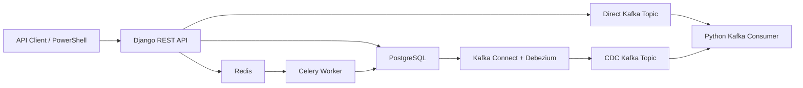

# RetailFlow Lab Project Explainer

This document explains the current project from the top down. The goal is to make the infrastructure, setup flow, business flow, and moving parts understandable before we add more features.

## 1. Current Project State

RetailFlow Lab is currently a local event-driven backend system.

At this stage, it can:

- Run PostgreSQL, Redis, Kafka, Zookeeper, and Kafka Connect with Debezium through Docker Compose.
- Run a Django REST API locally.
- Persist retail data in PostgreSQL.
- Use Redis as a Django cache.
- Create orders through an API endpoint.
- Trigger a Celery task through Redis after an order is committed.
- Update the order status asynchronously.
- Publish application events directly from Django to Kafka.
- Stream PostgreSQL table changes into Kafka through Debezium CDC.
- Run a Python Kafka consumer that reads both direct Kafka events and Debezium-generated CDC topics.
- Run the API, Celery worker, and Kafka consumer as Docker containers through Docker Compose.

The current project is intentionally local-first. AWS, Kubernetes, and CI/CD are planned, but not yet the active runtime path.

## 2. Big Picture Runtime Flow



In plain English:

1. You call the Django API.
2. Django writes business data into PostgreSQL.
3. Django can read/write Redis cache for fast temporary data.
4. Django can publish selected application events directly to Kafka.
5. Django schedules async work through Celery.
6. Redis acts as the Celery message broker.
7. Celery picks up the task and updates the order.
8. Debezium watches PostgreSQL committed changes.
9. Debezium publishes those changes into Kafka.
10. The Kafka consumer reads both direct events and database-change events.

## 3. Repository Layout

The important folders right now are:

```text
backend/
  manage.py
  retailflow/
    settings.py
    celery.py
    urls.py
  apps/
    inventory/
    orders/
    replenishment/
    events/

infra/
  docker-compose/
    docker-compose.local.yml
    debezium-postgres.json

workers/
  kafka_consumer/
    main.py

docs/
  design/
  lld/
  project-explainer.md

scripts/
  local/

.github/
  workflows/
```

How to read this structure:

- `backend/` is the main Django service.
- `backend/apps/` contains domain modules.
- `infra/docker-compose/` contains local infrastructure containers.
- `workers/kafka_consumer/` contains the standalone Kafka consumer.
- `backend/Dockerfile` builds the API image and is reused by the Celery worker.
- `workers/kafka_consumer/Dockerfile` builds the Kafka consumer image.
- `docs/` contains explanation and design documentation.
- `.github/workflows/` contains early CI/CD workflow placeholders.

## 4. Infrastructure Components

### PostgreSQL

PostgreSQL is the source of truth.

It stores:

- Stores
- Warehouses
- SKUs
- Inventory balances
- Orders
- Order lines
- Event logs

Configured in:

```text
infra/docker-compose/docker-compose.local.yml
backend/retailflow/settings.py
.env
.env.example
```

Important Docker Compose config:

```yaml
postgres:
  image: postgres:16
  container_name: retailflow-postgres
  ports:
    - "5433:5432"
```

Why `5433:5432`?

- `5432` is the port inside the container.
- `5433` is the port exposed on your laptop.
- This avoids conflict with another local PostgreSQL already using `5432`.

Important CDC config:

```yaml
command:
  - postgres
  - -c
  - wal_level=logical
  - -c
  - max_wal_senders=10
  - -c
  - max_replication_slots=10
```

This enables logical replication, which Debezium needs to read committed database changes.

### Redis

Redis is currently used in two ways:

- Celery broker/result backend.
- Django cache backend.

Configured in:

```text
infra/docker-compose/docker-compose.local.yml
backend/retailflow/settings.py
```

Important settings:

```python
CELERY_BROKER_URL = redis://localhost:6379/0
CELERY_RESULT_BACKEND = redis://localhost:6379/1
```

Important cache setting:

```python
CACHES = {
    "default": {
        "BACKEND": "django.core.cache.backends.redis.RedisCache",
        "LOCATION": "redis://localhost:6379/2",
    }
}
```

Database usage split:

- Redis DB `0`: Celery broker.
- Redis DB `1`: Celery results.
- Redis DB `2`: Django cache.

Role in the flow:

- Django creates a Celery task message.
- Redis stores that message.
- Celery worker consumes the message.
- Celery executes the background job.
- Django can store short-lived cache values independently of Celery.

### Celery

Celery handles async work outside the API request path.

Configured in:

```text
backend/retailflow/celery.py
backend/retailflow/__init__.py
backend/retailflow/settings.py
backend/apps/orders/tasks.py
```

The project-level Celery app is:

```text
backend/retailflow/celery.py
```

The current business task is:

```text
backend/apps/orders/tasks.py
```

Current task responsibility:

- Load an order by ID.
- Mark it as `processing`.
- Save the order.

Current Celery annotation:

```python
@shared_task(bind=True, autoretry_for=(Exception,), retry_backoff=True, max_retries=3)
```

Meaning:

- `shared_task`: makes this function a Celery task.
- `bind=True`: gives access to the task instance as `self`.
- `autoretry_for=(Exception,)`: retry if an exception happens.
- `retry_backoff=True`: wait progressively longer between retries.
- `max_retries=3`: retry up to three times.

### Kafka

Kafka is the event streaming layer.

Configured in:

```text
infra/docker-compose/docker-compose.local.yml
```

Important config:

```yaml
kafka:
  image: confluentinc/cp-kafka:7.6.1
  ports:
    - "9092:9092"
  environment:
    KAFKA_ADVERTISED_LISTENERS: PLAINTEXT://kafka:29092,PLAINTEXT_HOST://localhost:9092
```

Why two listeners?

- `kafka:29092` is used by other containers in the Docker network.
- `localhost:9092` is used by programs running on your laptop, like `workers/kafka_consumer/main.py`.

Kafka topics currently used by the consumer:

```text
retailflow.public.orders_order
retailflow.direct.order_signals
retailflow.direct.order_signals.partitioned
```

Topic meanings:

- `retailflow.public.orders_order`: created by Debezium from PostgreSQL CDC.
- `retailflow.direct.order_signals`: receives direct application-published events from Django.
- `retailflow.direct.order_signals.partitioned`: clean multi-partition demo topic for partitioning experiments.

This gives two learning paths:

- CDC path: database change -> Debezium -> Kafka.
- Direct path: application code -> Kafka.

### Zookeeper

Zookeeper supports this Confluent Kafka image.

Configured in:

```text
infra/docker-compose/docker-compose.local.yml
```

It is not business-facing. It exists because this Kafka image uses Zookeeper for broker coordination.

### Kafka Connect

Kafka Connect runs connectors that move data into or out of Kafka.

Configured in:

```text
infra/docker-compose/docker-compose.local.yml
```

Important config:

```yaml
kafka-connect:
  image: debezium/connect:2.7.0.Final
  ports:
    - "8083:8083"
  environment:
    BOOTSTRAP_SERVERS: kafka:29092
    GROUP_ID: retailflow-connect
    CONFIG_STORAGE_TOPIC: retailflow_connect_configs
    OFFSET_STORAGE_TOPIC: retailflow_connect_offsets
    STATUS_STORAGE_TOPIC: retailflow_connect_status
```

Kafka Connect exposes an HTTP API at:

```text
http://localhost:8083
```

You use that API to register the Debezium connector.

### Debezium CDC

Debezium reads database changes from PostgreSQL and publishes them to Kafka.

Configured in:

```text
infra/docker-compose/debezium-postgres.json
```

Important connector config:

```json
{
  "connector.class": "io.debezium.connector.postgresql.PostgresConnector",
  "database.hostname": "postgres",
  "database.port": "5432",
  "topic.prefix": "retailflow",
  "plugin.name": "pgoutput",
  "slot.name": "retailflow_debezium",
  "publication.autocreate.mode": "filtered",
  "table.include.list": "public.orders_order,public.orders_orderline,public.inventory_inventorybalance"
}
```

Important meanings:

- `connector.class`: tells Kafka Connect to run the Debezium PostgreSQL connector.
- `database.hostname`: uses Docker service name `postgres`, not `localhost`.
- `database.port`: uses container-internal PostgreSQL port `5432`.
- `topic.prefix`: all Debezium topics start with `retailflow`.
- `plugin.name`: uses PostgreSQL `pgoutput` logical decoding.
- `slot.name`: PostgreSQL replication slot used by Debezium.
- `publication.autocreate.mode`: Debezium creates a filtered publication for selected tables.
- `table.include.list`: only these tables are streamed.

Current streamed tables:

- `public.orders_order`
- `public.orders_orderline`
- `public.inventory_inventorybalance`

Current important topic:

```text
retailflow.public.orders_order
```

## 5. Business Domain

The project models a retail inventory and replenishment backend.

Current business entities:

- Store: a retail store placing demand.
- Warehouse: a fulfillment location holding inventory.
- SKU: a sellable product.
- InventoryBalance: stock position for one SKU in one warehouse.
- Order: demand from a store.
- OrderLine: requested SKU and quantity inside an order.
- EventLog: placeholder for future event auditing.

## 6. Current Business Flow

The implemented flow is intentionally small but end-to-end.

### Order Creation Flow

1. API client sends an order request.
2. `OrderCreateView` receives the request.
3. `OrderCreateSerializer` validates and creates the order.
4. The serializer creates `Order` and `OrderLine` records in one database transaction.
5. After the transaction commits, Django schedules `process_order.delay(order.id)`.
6. Celery worker picks up the task from Redis.
7. Celery updates order status from `created` to `processing`.
8. PostgreSQL records the insert and update.
9. Debezium reads those committed table changes.
10. Debezium publishes change events to Kafka.
11. Kafka consumer reads the order topic and prints the event.

### Why `transaction.on_commit` Matters

The Celery task is scheduled only after the database transaction commits.

That prevents this bad timing problem:

- API creates order inside transaction.
- Celery starts too early.
- Celery tries to read an order that is not committed yet.

So the current design says: first commit data, then schedule async work.

## 7. Module Responsibilities

### `backend/apps/inventory/models.py`

Owns inventory-side domain objects:

- `Store`
- `Warehouse`
- `Sku`
- `InventoryBalance`

Current responsibility:

- Represent stock and fulfillment data.
- Provide data needed by order creation and future allocation logic.

### `backend/apps/orders/models.py`

Owns order-side domain objects:

- `Order`
- `OrderLine`

Current responsibility:

- Represent customer/store demand.
- Track order status.
- Store requested and allocated quantities.

### `backend/apps/orders/serializers.py`

Owns the current order write workflow.

Current responsibility:

- Validate incoming order payloads.
- Create `Order`.
- Create child `OrderLine` records.
- Schedule Celery task after commit.

This is currently the central business-flow file.

### `backend/apps/orders/tasks.py`

Owns async order processing.

Current responsibility:

- Receive order ID from Celery.
- Update order status to `processing`.

Future responsibility:

- Reserve stock.
- Allocate warehouse inventory.
- Reject orders if stock is not available.
- Emit notification/report events.

### `backend/apps/events/views.py`

Owns infrastructure learning endpoints.

Current responsibility:

- `CacheProbeView`: reads and writes a Redis-backed Django cache key.
- `DirectEventPublishView`: accepts a small JSON payload and publishes it directly to Kafka.

### `backend/apps/events/kafka.py`

Owns direct Kafka producer behavior.

Current responsibility:

- Create a Kafka producer using `KAFKA_BOOTSTRAP_SERVERS`.
- Publish JSON messages to `KAFKA_DIRECT_TOPIC`.

### `backend/retailflow/settings.py`

Owns application configuration.

Current responsibility:

- Read `.env`.
- Configure PostgreSQL.
- Configure Django REST Framework.
- Configure Celery broker/result backend.
- Configure Redis cache.
- Configure direct Kafka producer settings.

### `backend/retailflow/celery.py`

Owns Celery application bootstrapping.

Current responsibility:

- Create Celery app.
- Load settings from Django settings.
- Auto-discover `tasks.py` files inside installed Django apps.

### `workers/kafka_consumer/main.py`

Owns Kafka consumption outside Django.

Current responsibility:

- Connect to Kafka at `localhost:9092`.
- Subscribe to `retailflow.public.orders_order`.
- Subscribe to `retailflow.direct.order_signals`.
- Subscribe to `retailflow.direct.order_signals.partitioned`.
- Poll messages.
- Classify messages as direct app events or Debezium CDC events.
- Print a normalized summary plus the raw payload.
- Commit offsets manually after processing.

## 8. Config Files To Study First

Read these in this order:

1. `infra/docker-compose/docker-compose.local.yml`
2. `.env.example`
3. `backend/retailflow/settings.py`
4. `backend/retailflow/celery.py`
5. `backend/apps/orders/serializers.py`
6. `backend/apps/orders/tasks.py`
7. `backend/apps/events/views.py`
8. `backend/apps/events/kafka.py`
9. `infra/docker-compose/debezium-postgres.json`
10. `workers/kafka_consumer/main.py`

This order mirrors the real runtime flow:

Infrastructure -> environment -> Django config -> Redis cache -> direct Kafka -> business write -> async task -> CDC -> event consumer.

## 9. Commands Run So Far

### Create Virtual Environment

```powershell
python -m venv .venv
.\.venv\Scripts\Activate.ps1
```

### Install Dependencies

```powershell
.\.venv\Scripts\python -m pip install -r backend\requirements\dev.txt
```

### Generate Migrations

```powershell
.\.venv\Scripts\python backend\manage.py makemigrations inventory orders events replenishment
```

### Validate Django Project

```powershell
.\.venv\Scripts\python backend\manage.py check
```

### Validate Linting

```powershell
.\.venv\Scripts\ruff check backend workers
```

### Validate Docker Compose

```powershell
docker compose -f infra\docker-compose\docker-compose.local.yml config
```

### Start PostgreSQL And Redis

```powershell
docker compose -f infra\docker-compose\docker-compose.local.yml up -d postgres redis
```

### Run Migrations

```powershell
.\.venv\Scripts\python backend\manage.py migrate
```

### Start Django API

```powershell
.\.venv\Scripts\python backend\manage.py runserver
```

### Start Celery Worker

Run from the `backend` directory:

```powershell
C:\Users\vipul\OneDrive\Desktop\SelfDev\DevHandsOn\.venv\Scripts\celery -A retailflow worker -l info
```

### Start Kafka Stack

```powershell
docker compose -f infra\docker-compose\docker-compose.local.yml up -d zookeeper kafka kafka-connect
```

### Register Debezium Connector

PowerShell version:

```powershell
$connectorConfig = Get-Content -Raw "infra\docker-compose\debezium-postgres.json"

Invoke-RestMethod `
  -Method Post `
  -Uri "http://localhost:8083/connectors" `
  -ContentType "application/json" `
  -Body $connectorConfig
```

### Check Kafka Connect Connectors

```powershell
Invoke-RestMethod "http://localhost:8083/connectors"
```

### Check Debezium Connector Status

```powershell
Invoke-RestMethod "http://localhost:8083/connectors/retailflow-postgres-connector/status"
```

### Start Kafka Consumer

```powershell
.\.venv\Scripts\python workers\kafka_consumer\main.py
```

## 10. Useful Verification Commands

### Docker Containers

```powershell
docker ps
```

### Container Logs

```powershell
docker logs retailflow-postgres
docker logs retailflow-redis
docker logs retailflow-kafka
docker logs retailflow-kafka-connect
```

### Stop Containers Without Deleting Data

```powershell
docker compose -f infra\docker-compose\docker-compose.local.yml down
```

### Stop Containers And Delete PostgreSQL Volume

Only use this when you want a fresh local database.

```powershell
docker compose -f infra\docker-compose\docker-compose.local.yml down -v
```

### Health Check API

```powershell
Invoke-RestMethod "http://localhost:8000/health/"
```

### Inventory API

```powershell
Invoke-RestMethod "http://localhost:8000/api/inventory/balances/"
```

### Redis Cache Probe

```powershell
Invoke-RestMethod "http://localhost:8000/api/events/cache-probe/"
```

Expected behavior:

- Response `cache_value` increases on each request.
- Value is stored in Redis DB `2`.
- Value expires after 300 seconds.

### Publish Direct Kafka Event

```powershell
$body = @{
  event_type = "order.signal.created"
  payload = @{
    order_id = 101
    store_code = "BLR-001"
    signal = "manual-direct-kafka-test"
  }
} | ConvertTo-Json -Depth 5

Invoke-RestMethod `
  -Method Post `
  -Uri "http://localhost:8000/api/events/direct-publish/" `
  -ContentType "application/json" `
  -Body $body
```

Expected behavior:

- API returns HTTP `202`.
- Kafka consumer prints a message from `retailflow.direct.order_signals`.

### Create Direct Kafka Topic With Partitions

```powershell
.\scripts\kafka\create-direct-topic.ps1 retailflow.direct.order_signals.partitioned 3 1
```

Meaning:

- Topic: `retailflow.direct.order_signals.partitioned`
- Partitions: `3`
- Replication factor: `1`, because local Kafka has one broker.

Describe the topic:

```powershell
.\scripts\kafka\describe-topic.ps1 retailflow.direct.order_signals.partitioned
```

List all topics:

```powershell
.\scripts\kafka\list-topics.ps1
```

Read the direct topic with Kafka CLI:

```powershell
.\scripts\kafka\read-direct-topic.ps1 retailflow.direct.order_signals.partitioned
```

### Publish With Different Partition Keys

By default, direct Kafka publishing uses `event_type` as the Kafka key.

Partition by event type:

```powershell
$body = @{
  topic = "retailflow.direct.order_signals.partitioned"
  event_type = "order.signal.created"
  partition_key_strategy = "event_type"
  payload = @{
    order_id = 101
    store_code = "BLR-001"
  }
} | ConvertTo-Json -Depth 5

Invoke-RestMethod `
  -Method Post `
  -Uri "http://localhost:8000/api/events/direct-publish/" `
  -ContentType "application/json" `
  -Body $body
```

Partition by order ID:

```powershell
$body = @{
  topic = "retailflow.direct.order_signals.partitioned"
  event_type = "order.signal.created"
  partition_key_strategy = "order_id"
  payload = @{
    order_id = 101
    store_code = "BLR-001"
  }
} | ConvertTo-Json -Depth 5

Invoke-RestMethod `
  -Method Post `
  -Uri "http://localhost:8000/api/events/direct-publish/" `
  -ContentType "application/json" `
  -Body $body
```

Partition by custom key:

```powershell
$body = @{
  topic = "retailflow.direct.order_signals.partitioned"
  event_type = "order.signal.created"
  partition_key_strategy = "custom"
  custom_key = "store:BLR-001"
  payload = @{
    order_id = 101
    store_code = "BLR-001"
  }
} | ConvertTo-Json -Depth 5

Invoke-RestMethod `
  -Method Post `
  -Uri "http://localhost:8000/api/events/direct-publish/" `
  -ContentType "application/json" `
  -Body $body
```

Expected response includes:

```json
{
  "delivery": {
    "topic": "retailflow.direct.order_signals.partitioned",
    "partition": 1,
    "offset": 4
  }
}
```

The exact partition may differ, but the same key should consistently map to the same partition while the topic partition count stays the same.

### Kafka Consumer Classification

When the consumer reads a message, it classifies the topic:

- `retailflow.public.*` -> `debezium_cdc`
- `retailflow.direct.*` -> `direct_app_event`

This makes the local logs easier to read because each message includes:

- classification
- topic
- partition
- offset
- key
- summary
- payload

### Create Order

```powershell
$body = @{
  store = 1
  lines = @(
    @{
      sku = 1
      requested_quantity = 3
    }
  )
} | ConvertTo-Json -Depth 5

Invoke-RestMethod `
  -Method Post `
  -Uri "http://localhost:8000/api/orders/" `
  -ContentType "application/json" `
  -Body $body
```

### Read Order

```powershell
Invoke-RestMethod "http://localhost:8000/api/orders/1/"
```

## 11. Kafka And Debezium Syntax To Understand

### Kafka Consumer Config

In `workers/kafka_consumer/main.py`:

```python
{
    "bootstrap.servers": "localhost:9092",
    "group.id": "retailflow-order-consumer",
    "auto.offset.reset": "earliest",
    "enable.auto.commit": False,
}
```

Meaning:

- `bootstrap.servers`: Kafka address used by this process.
- `group.id`: consumer group name.
- `auto.offset.reset`: start from earliest available event if no offset exists.
- `enable.auto.commit`: disabled so the code commits only after processing.

### Topic Subscription

```python
consumer.subscribe(["retailflow.public.orders_order"])
```

Meaning:

- The consumer listens to one Debezium-created topic.
- Topic name follows `topic.prefix.schema.table`.

Current project version subscribes to multiple topics:

```python
consumer.subscribe([
    "retailflow.public.orders_order",
    "retailflow.direct.order_signals",
    "retailflow.direct.order_signals.partitioned",
])
```

Meaning:

- One consumer can observe both CDC events and direct app-published events.
- This makes the difference between the two event styles visible while running locally.
- The consumer also prints a normalized summary so the Debezium envelope is easier to scan.

### Kafka Partitioning

Kafka assigns a message to a partition using either:

- An explicit partition number, if the producer provides one.
- A hash of the message key, if the message has a key.
- A producer strategy, often round-robin/sticky behavior, if there is no key.

This project uses keyed partitioning for direct app events.

Current strategies:

- `event_type`: all events of the same type usually go to the same partition.
- `order_id`: all events for the same order usually go to the same partition.
- `custom`: lets you experiment with keys like `store:BLR-001`.

Why `order_id` is useful:

- All events for one order stay ordered relative to each other.
- Different orders can spread across partitions.

Why `event_type` is useful:

- Easy to understand.
- Good for demos.
- Less ideal if one event type is much more common than others, because one partition can become hot.

### Direct Kafka Producer

In `backend/apps/events/kafka.py`:

```python
producer = Producer({"bootstrap.servers": settings.KAFKA_BOOTSTRAP_SERVERS})
producer.produce(topic, key=event_type, value=json_payload)
producer.flush(10)
```

Meaning:

- Django creates a producer connected to Kafka.
- `produce` queues the message for the configured topic.
- `flush` waits briefly so the local demo can confirm delivery immediately.

### Polling Messages

```python
message = consumer.poll(1.0)
```

Meaning:

- Wait up to one second for a Kafka message.
- If no message arrives, loop again.

### Manual Offset Commit

```python
consumer.commit(message=message)
```

Meaning:

- The consumer records that this message has been handled.
- In production, this should happen after real processing succeeds.

### Debezium Connector Registration

```powershell
Invoke-RestMethod `
  -Method Post `
  -Uri "http://localhost:8083/connectors" `
  -ContentType "application/json" `
  -Body $connectorConfig
```

Meaning:

- You are calling Kafka Connect's REST API.
- Kafka Connect reads the JSON body.
- It starts a Debezium connector task.
- Debezium begins reading PostgreSQL changes.

## 12. Docker Compose Management

Docker Compose is currently the local infrastructure controller.

The main file:

```text
infra/docker-compose/docker-compose.local.yml
```

Start selected services:

```powershell
docker compose -f infra\docker-compose\docker-compose.local.yml up -d postgres redis
```

Start all infrastructure services:

```powershell
docker compose -f infra\docker-compose\docker-compose.local.yml up -d
```

Start the full containerized application stack:

```powershell
docker compose -f infra\docker-compose\docker-compose.local.yml up -d --build
```

This now includes:

- `api`
- `celery-worker`
- `kafka-consumer`
- `postgres`
- `redis`
- `zookeeper`
- `kafka`
- `kafka-connect`

Recreate a service after config changes:

```powershell
docker compose -f infra\docker-compose\docker-compose.local.yml up -d --force-recreate postgres
```

See service status:

```powershell
docker compose -f infra\docker-compose\docker-compose.local.yml ps
```

Read logs:

```powershell
docker compose -f infra\docker-compose\docker-compose.local.yml logs kafka-connect
```

## 13. Current Limitations

The current implementation is a working learning milestone, not the finished product.

Current limitations:

- Order processing only moves status to `processing`.
- No real inventory allocation yet.
- No idempotency lookup behavior yet, even though the field exists.
- No automated seed command yet.
- Kafka consumer classifies and prints events, but it does not persist or route them yet.
- No SQS/SNS/S3/Lambda integration yet.
- The full containerized stack still needs local runtime verification after image builds.
- No Kubernetes manifests implemented yet.
- CI now runs lint, Django checks, migration checks, focused tests, and Docker image builds.

## 14. Next Recommended Steps

The next steps should prioritize infrastructure integrations while keeping business logic minimal.

### Step 1: Add Repeatable Infra Demos

Add small endpoints and scripts that exercise one tool at a time:

- Redis cache probe.
- Direct Kafka publisher.
- Celery task trigger.
- Debezium connector status check.
- Kafka topic inspection commands.

Why:

- Makes each infrastructure component observable in isolation.

### Step 2: Add Seed Command

Create a repeatable Django management command that inserts a store, warehouse, SKU, and inventory balance.

Why:

- Avoid manual shell setup.
- Make demos repeatable.

### Step 3: Make Business Logic Just Real Enough

Keep order processing minimal but realistic:

- Reads requested order lines.
- Finds available inventory.
- Optionally reserves stock.
- Sets order to `allocated` or `rejected`.

Why:

- Gives Redis, Celery, Kafka, and CDC meaningful events without over-investing in business complexity.

### Step 4: Improve Kafka Consumer Behavior

Move from printing events to simple event routing.

Possible behavior:

- If topic is `retailflow.direct.order_signals`, store an `EventLog`.
- If topic is `retailflow.public.orders_order`, normalize the Debezium payload.
- Later, publish selected events to SQS.

### Step 5: Add Tests For Infra Integration Boundaries

Add focused tests for:

- Cache endpoint contract.
- Direct Kafka producer wrapper with mocked producer.
- Celery task behavior.
- API order creation.

Why:

- Keeps CI practical without requiring Kafka in every unit test.

### Step 6: Verify Full Containerized Runtime

Use Docker Compose to run:

- API
- Celery worker
- Kafka consumer
- Postgres
- Redis
- Kafka
- Kafka Connect

Why:

- This is the closest local shape to what we will later deploy to EC2.

### Step 7: Add Tests For Containerized And Infra Boundaries

Add focused tests and CI checks for:

- Django checks
- order API
- cache endpoint
- direct Kafka producer wrapper
- Docker image builds

Current status:

- Cache endpoint tests added.
- Direct Kafka producer helper tests added.
- CI workflow runs these checks automatically.

### Step 8: Add Local Kubernetes Manifests

Use Docker Desktop Kubernetes for:

- API deployment.
- Celery worker deployment.
- Kafka consumer deployment.
- Redis deployment.
- ConfigMaps and Secrets.

PostgreSQL can initially remain local/Compose or run as a simple local Kubernetes workload for learning.

### Step 9: Add AWS Free-Tier Integrations

Add carefully:

- S3 for tiny report files.
- SQS for low-volume event queueing.
- SNS for notification fan-out.
- Lambda for lightweight SQS processing.
- Optional RDS PostgreSQL only after Free Tier eligibility is confirmed.

## 15. Mental Model To Keep

Think of this project in layers:

```text
Business API
  Django REST endpoint creates orders.

Transaction Store
  PostgreSQL stores the truth.

Async Work
  Celery + Redis handle slow/background processing.

Change Data Capture
  Debezium watches committed PostgreSQL changes.

Event Streaming
  Kafka transports those changes as events.

Consumers
  Worker services react to events.

Deployment
  Docker Compose locally first, Kubernetes locally next, EC2 Docker Compose later.
```

That is the backbone of the project. Every future phase should attach cleanly to one of these layers.
